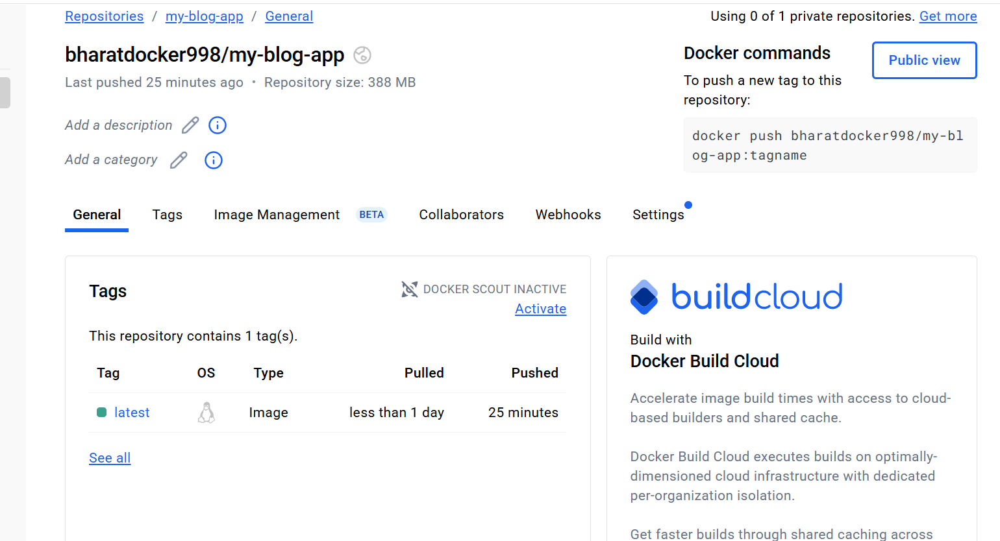

# Blog API

A RESTful Blog API built with Node.js, Express.js, and MongoDB. This API provides full CRUD operations for blog posts with JWT-based authentication, containerized with Docker for seamless deployment.

## Features

- 🔐 JWT-based user authentication (signup/login)
- 📝 Full CRUD operations for blog posts
- 🛡️ Protected routes (only authenticated users can create/update/delete posts)
- 👀 Public access to view all posts
- ✅ Input validation and error handling
- 🔒 Password hashing with bcryptjs
- 📄 Pagination support for posts
- 🏗️ Clean, modular, and production-ready code
- 🐳 **Docker containerized with multi-stage builds**
- ☁️ **Deployed on Docker Hub for easy distribution**
- 🚀 **Production-ready DevOps implementation**

## Tech Stack

- **Node.js** - Runtime environment
- **Express.js** - Web framework
- **MongoDB** - Database
- **Mongoose** - ODM for MongoDB
- **JWT** - Authentication
- **bcryptjs** - Password hashing
- **express-validator** - Input validation
- **Docker** - Containerization platform
- **Docker Hub** - Container registry

## DevOps & Deployment

### 🐳 Docker Implementation

This project demonstrates modern DevOps practices with full Docker containerization:

- **Multi-stage Dockerfile** for optimized production builds
- **Docker Compose** for local development with MongoDB
- **Docker Hub registry** for image distribution
- **Environment-based configuration** for different deployment scenarios
- **Health checks** and proper signal handling

### Docker Hub Deployment

The application is available as a Docker image on Docker Hub:

```bash
# Pull the latest image
docker pull bharatdocker998/blog-api:latest

# Run the container
docker run -d \
  --name blog-api \
  -p 5000:5000 \
  -e MONGODB_URI=mongodb://your-mongo-host:27017/blog-api \
  -e JWT_SECRET=your-jwt-secret \
  bharatdocker998/my-blog-api:latest
```

### Quick Start with Docker

1. **Using Docker Compose (Recommended)**
   ```bash
   git clone https://github.com/Bharat1Rajput/BlogAPI.git
   cd blog-api
   docker-compose up -d
   ```

2. **Using Docker directly**
   ```bash
   # Build the image
   docker build -t blog-api .
   
   # Run with MongoDB container
   docker network create blog-network
   
   docker run -d \
     --name mongo \
     --network blog-network \
     -v mongo-data:/data/db \
     mongo:latest
   
   docker run -d \
     --name blog-api \
     --network blog-network \
     -p 5000:5000 \
     -e MONGODB_URI=mongodb://mongo:27017/blog-api \
     -e JWT_SECRET=your-super-secret-jwt-key \
     blog-api
   ```

## Project Structure

```
blog-api/
├── server.js              # Entry point
├── package.json           # Dependencies and scripts
├── Dockerfile             # Docker configuration
├── .dockerignore          # Docker ignore rules
├── config/
│   └── db.js             # MongoDB connection
├── models/
│   ├── User.js           # User schema
│   └── Post.js           # Post schema
├── routes/
│   ├── auth.js           # Authentication routes
│   └── posts.js          # Post routes
├── controllers/
│   ├── authController.js # Auth logic
│   └── postController.js # Post logic
├── middleware/
│   ├── auth.js           # JWT authentication
│   └── errorHandler.js   # Error handling
└── README.md
```

## Installation Options

### Option 1: Docker (Recommended)

1. **Prerequisites**
   - Docker installed on your system
   - Docker Compose (optional, for easier setup)

2. **Quick start**
   ```bash
   git clone https://github.com/Bharat1Rajput/BlogAPI.git
   cd blog-api
   docker-compose up -d
   ```

3. **Access the API**
   The API will be available at `http://localhost:5000`

### Option 2: Traditional Setup

1. **Clone the repository**
   ```bash
   git clone https://github.com/Bharat1Rajput/BlogAPI.git
   cd blog-api
   ```

2. **Install dependencies**
   ```bash
   npm install
   ```

3. **Set up environment variables**
   Create a `.env` file in the root directory:
   ```env
   PORT=5000
   MONGODB_URI=mongodb://localhost:27017/blog-api
   JWT_SECRET=your-super-secret-jwt-key-change-this-in-production
   NODE_ENV=development
   ```

4. **Start MongoDB**
   Make sure MongoDB is running on your system.

5. **Run the application**
   ```bash
   # Development mode
   npm run dev
   
   # Production mode
   npm start
   ```

## Docker Configuration

### Dockerfile Features

- **Multi-stage build** for smaller production images
- **Non-root user** for security
- **Proper signal handling** for graceful shutdowns
- **Health checks** for container orchestration
- **Optimized layer caching** for faster builds

---

## API Endpoints

### Authentication

| Method | Endpoint | Description | Access |
|--------|----------|-------------|---------|
| POST | `/api/auth/signup` | Register a new user | Public |
| POST | `/api/auth/login` | Login user | Public |

### Posts

| Method | Endpoint | Description | Access |
|--------|----------|-------------|---------|
| GET | `/api/posts` | Get all posts (with pagination) | Public |
| GET | `/api/posts/:id` | Get single post by ID | Public |
| POST | `/api/posts` | Create a new post | Private |
| PUT | `/api/posts/:id` | Update a post | Private |
| DELETE | `/api/posts/:id` | Delete a post | Private |

### Health Check

| Method | Endpoint | Description |
|--------|----------|-------------|
| GET | `/api/health` | Check API status |

## API Usage Examples

### 1. Register a new user

```bash
curl -X POST http://localhost:5000/api/auth/signup \
  -H "Content-Type: application/json" \
  -d '{
    "username": "johndoe",
    "email": "john@example.com",
    "password": "Password123"
  }'
```

### 2. Login

```bash
curl -X POST http://localhost:5000/api/auth/login \
  -H "Content-Type: application/json" \
  -d '{
    "email": "john@example.com",
    "password": "Password123"
  }'
```

### 3. Create a new post (requires authentication)

```bash
curl -X POST http://localhost:5000/api/posts \
  -H "Content-Type: application/json" \
  -H "Authorization: Bearer YOUR_JWT_TOKEN" \
  -d '{
    "title": "My First Blog Post",
    "content": "This is the content of my first blog post!"
  }'
```

### 4. Get all posts

```bash
curl -X GET http://localhost:5000/api/posts
```

### 5. Get posts with pagination

```bash
curl -X GET "http://localhost:5000/api/posts?page=1&limit=5"
```

## Request/Response Format

### Success Response
```json
{
  "success": true,
  "message": "Operation successful",
  "data": {
    // Response data
  }
}
```

### Error Response
```json
{
  "success": false,
  "message": "Error description",
  "errors": [
    // Validation errors (if any)
  ]
}
```

## Authentication

The API uses JWT (JSON Web Tokens) for authentication. Include the token in the Authorization header:

```
Authorization: Bearer YOUR_JWT_TOKEN
```

## Validation Rules

### User Registration/Login
- **Username**: 3-30 characters, alphanumeric and underscores only
- **Email**: Valid email format
- **Password**: Minimum 6 characters, must contain at least one lowercase letter, one uppercase letter, and one number

### Blog Posts
- **Title**: 1-200 characters
- **Content**: 1-5000 characters

## Error Handling

The API includes comprehensive error handling for:
- Validation errors
- Authentication errors
- Database errors
- JWT token errors
- 404 Not Found errors
- 500 Internal Server errors

## Development

### Scripts
- `npm start` - Start the server in production mode
- `npm run dev` - Start the server in development mode with nodemon
- `docker build -t blog-api .` - Build Docker image
- `docker-compose up -d` - Start all services with Docker Compose

### Environment Variables
- `PORT` - Server port (default: 5000)
- `MONGODB_URI` - MongoDB connection string
- `JWT_SECRET` - Secret key for JWT tokens
- `NODE_ENV` - Environment (development/production)

## DevOps Best Practices Implemented

### 🔧 Containerization
- Multi-stage Docker builds for optimized images
- Docker Compose for local development
- Health checks and proper signal handling
- Security-focused container configuration

### 🚀 Deployment
- Docker Hub registry for image distribution
- Environment-based configuration
- Production-ready container orchestration
- Automated build and deployment pipeline ready

### 🛡️ Security
- Non-root container execution
- Secure environment variable handling
- Input validation and sanitization
- JWT-based authentication

### 📊 Monitoring & Health
- Health check endpoints
- Proper error handling and logging
- Container health monitoring
- Production monitoring ready

## Production Deployment

### Using Docker Hub Image

```bash
# Pull and run the production image
docker pull bharatdocker998/my-blog-api:latest

docker run -d \
  --name blog-api-prod \
  -p 80:5000 \
  -e MONGODB_URI=mongodb://your-production-mongo:27017/blog-api \
  -e JWT_SECRET=your-production-jwt-secret \
  -e NODE_ENV=production \
  --restart unless-stopped \
  yourusername/blog-api:latest
```

### Production Considerations

1. **Container Security**
   - Use specific image tags instead of `latest`
   - Regularly update base images for security patches
   - Implement container scanning in CI/CD pipeline

2. **Orchestration**
   - Use Kubernetes or Docker Swarm for production
   - Implement proper load balancing
   - Set up auto-scaling based on resource usage

3. **Monitoring**
   - Container health monitoring
   - Application performance monitoring (APM)
   - Log aggregation and analysis

4. **Data Persistence**
   - Use managed MongoDB services (MongoDB Atlas)
   - Implement proper backup strategies
   - Configure data volume management

## DevOps Skills Demonstrated

This project showcases the following DevOps competencies:

- **Containerization**: Docker multi-stage builds and optimization
- **Container Registry**: Docker Hub image management and distribution  
- **Orchestration**: Docker Compose for multi-container applications
- **Configuration Management**: Environment-based configuration
- **Security**: Container security best practices and non-root execution
- **Health Monitoring**: Application health checks and monitoring readiness
- **Production Deployment**: Production-ready containerized deployment strategies
---

## Screenshots & Demos



## License

ISC | built with ❤ by Bharat

---
